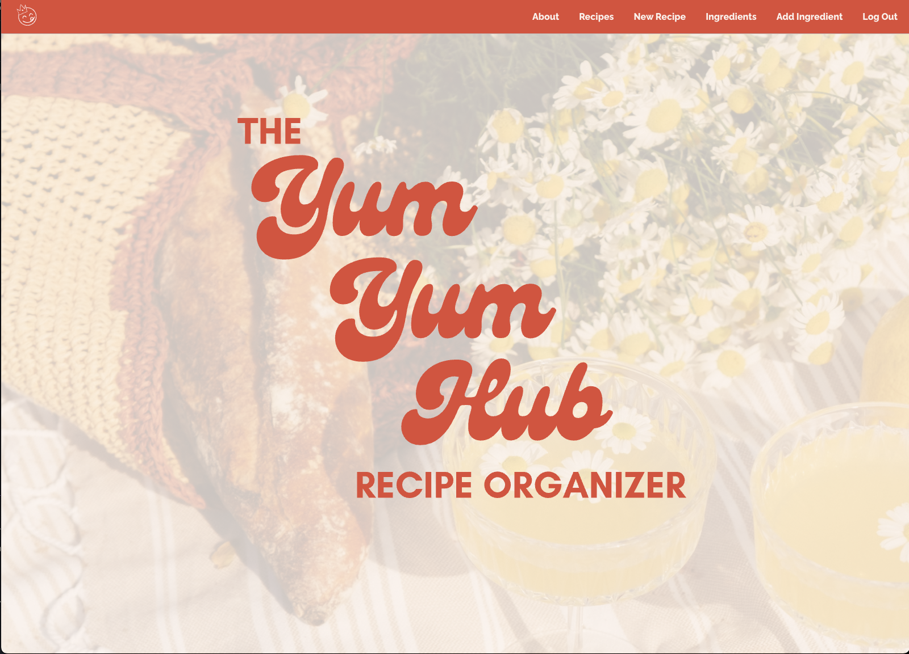
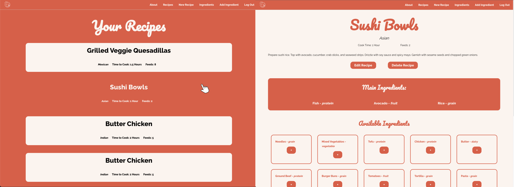

# The Yum Yum Hub Recipe Organizer 🧑🏼‍🍳

## Visit the deployed application [here 🔗](https://theyumyumhubrecipecollector.fly.dev/)

#### Want to view the app, but don't want to create your own profile? Use ours!

**Username**: YYHExplorer

**Password**: YuHuEx786!

Note - *Please be respecful while browsing and creating content on our guest YYHExplorer profile*

## Welcome to my first Python/Django app! 

The Yum Yum Hub is designed to be your personal kitchen companion, helping you to record and organize your favorite recipes. 

With Yum Yum Hub, you can easily create and store your culinary masterpieces, track cooking events for when you've prepared a recipe, and add valuable notes to enhance your future cooking experiences.

Whether you're a seasoned chef or a novice in the kitchen, Yum Yum Hub is your go-to tool for making and improving your beloved recipes, ensuring every dish you create is a delicious success, today and for years to come!

### Skills & Technologies Used ⚙️
- Full-stack development
- Full CRUD functionality
- ERD design
- Data entity management
- CSS Flexbox
- Django
- Python
- Neon Tech
- Authentication
- CSS Styling
- Git Version Control

### Credits 🥳
- Canva for stock image used in Home Page